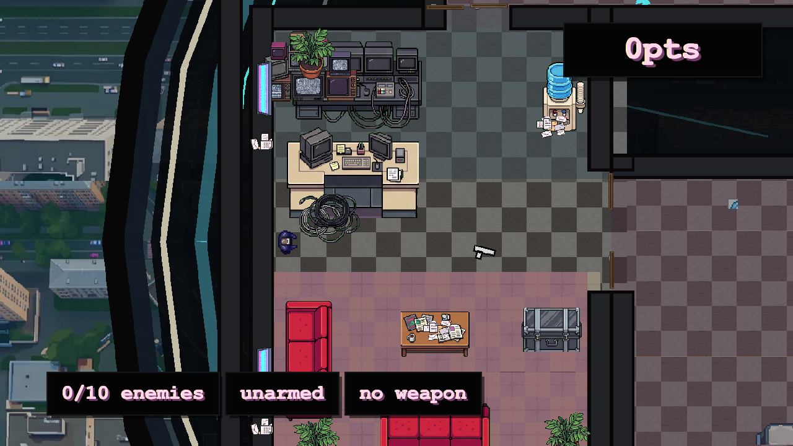

# TV Studio Shooter

`TV Studio Shooter` - браузерный top-down shooter на Phaser, TypeScript и Vite. Сейчас основной уровень - `Ring TV Tower`: герой с CRT-телевизором вместо головы выбирается из лифта на закрытую телебашню, проходит через ресепшен, студии, аппаратные и финальную площадку прямого эфира.



## Формат игры

- Вид строго сверху, без изометрии.
- Быстрые короткие забеги на 2-5 минут.
- Управление: `WASD` - движение, мышь - прицел, ЛКМ - стрельба, `E` / `У` - подобрать оружие, `R` - рестарт после смерти или победы.
- Запуск в браузере: `npm install`, затем `npm run dev`.
- Старый тестовый уровень доступен через `/?level=reception-hub`; уровень по умолчанию - `ring-tower`.

## Игровые механики

- Комнатная зачистка: двери, стены, укрытия, узкие проходы и открытые студийные зоны.
- Оружие без инвентаря: персонаж держит один пистолет или винтовку, новое оружие заменяет текущее.
- Автоматическая перезарядка после пустого магазина.
- Враги с простым AI: посты, подозрение, слух, зрение, переход в бой.
- Типы угроз: стрелки и melee-монстры.
- Физические двери открываются от давления и блокируют движение/пули, пока закрыты.
- Победа на `reception-hub` наступает после смерти всех врагов; на `ring-tower` - после финального боя и возврата в лифт.

## Сюжет и герои

Игрок - человек в костюме с CRT-головой, попавший в корпоративный телекомплекс во время эфирного локдауна. Башня выглядит как смесь конца 1990-х, прямого эфира, охраны, backstage-хлама и странного апокалиптического шоу. Враги - вооруженные сотрудники/охранники, CRT-варианты людей и ближние монстры.

## Устройство репозитория

```text
src/
  game/
    content/       уровни, оружие, враги, двери, пропсы
    input/         клавиатура, мышь, игровые действия
    simulation/    состояние игры, коллизии, combat, AI, цели уровней
  phaser/
    scenes/        Phaser-сцена
    view/          отрисовка актеров, фона, FX, ассетов
    audio/         игровые звуки
  ui/hud/          DOM HUD поверх canvas
  assets/
    vendor/        сторонние пакеты ассетов и звуков
    generated/     утвержденные сгенерированные игровые ассеты
    level-art/     фоновые изображения уровней
docs/superpowers/  спеки и планы разработки
docs/assets/       изображения для документации
output/            рабочие генерации и эксперименты, не источник истины
```

## Материалы и лицензии

- Игра и исходный код пока не имеют публичной лицензии. До появления `LICENSE` считать проект закрытым для распространения вне согласованной разработки.
- `src/assets/vendor/valentint-scifi/` - сторонний sci-fi top-down asset pack; использовать и распространять только в рамках его исходной лицензии.
- `src/assets/vendor/kenney-audio/` - звуки Kenney под CC0; gunshot-звуки Vincent Sevedge под Creative Commons Attribution 3.0 Unported.
- `src/assets/generated/` и `src/assets/level-art/` - утвержденные AI/ручные игровые материалы проекта; рабочие исходники и черновики лежат в игнорируемом `output/`.

## Для контрибьюторов

Перед изменениями проверь текущие спеки в `docs/superpowers/specs/`. Держи игровую логику в `src/game/simulation`, Phaser - только адаптером отрисовки и ввода. Для новых ассетов сохраняй строгий top-down ракурс; если используешь Nano Banana/Nano Banana Pro, проси однотонный chroma key фон, а не прозрачность.
