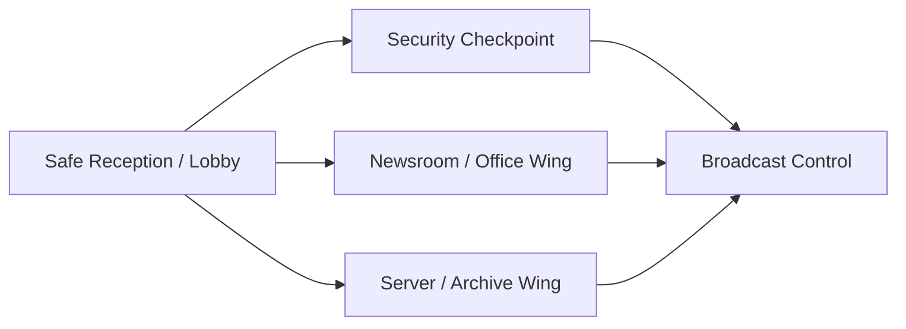

# Reception Hub Demo Map Design

## Goal

Build the next demo level as a compact corporate broadcast complex that shows the current shooter mechanics clearly, looks denser and closer to the reference material, and gives the player a safe starting room for testing movement, aiming, weapon pickup, doors, and collision rules.

This is a design-only spec. Implementation should happen after a separate implementation plan is approved.

## Direction

The selected layout is **Reception Hub**.

The level is centered around a safe reception room with multiple branches. This keeps the demo easy to test while avoiding a purely linear corridor. The implied story is a corporate broadcast facility after an internal lockdown: the reception still looks almost normal, security is active, the newsroom is damaged, the server/archive wing suggests evidence was being hidden, and the broadcast control room is the final visual payoff.

## Map Structure

Target map size: about `2200x1500` pixels. The full map should not fit on one screen, so the camera follow behavior is part of the playable experience.

Room flow:

### Safe Reception / Lobby

The player starts in a safe reception room. No enemies spawn there.

Purpose:

- Test WASD movement.
- Test mouse aiming.
- Test pickup with `E` / Russian-layout `У`.
- Test that the player can hold only one weapon.
- Test that picking up a new weapon throws the old weapon aside with impulse and spin.
- Test single and double hinged doors without combat pressure.
- Test movement collision against furniture.

Suggested contents:

- Reception desk.
- Couch or chairs.
- Small table.
- Plant pots.
- One pistol on the floor or reception desk.
- One single-leaf door.
- One double-leaf door.

### Security Checkpoint

This is the first combat room, connected from the reception.

Purpose:

- Test that doors open by physical pressure from the player or enemies.
- Test that closed doors block bullets.
- Introduce one armed humanoid enemy.
- Test hard cover such as walls, columns, and security consoles.

Suggested contents:

- Narrow threshold from reception.
- Security counter or console.
- One armed humanoid with pistol.
- Hard cover placed so the player can read bullet blocking clearly.

### Newsroom / Office Wing

This is the larger soft-cover combat space.

Purpose:

- Test cluttered movement around furniture.
- Test soft blockers: visible, audible, bullet-passable, movement-blocking objects.
- Show more blood, bodies, bullet impacts, and office destruction.
- Introduce a mixed threat without making the demo unreadable.

Suggested contents:

- Office desks.
- Chairs.
- Monitors.
- TV displays.
- Cable/debris decals.
- Plant pots.
- Two armed humanoid enemies.
- One frog-like melee monster.

### Server / Archive Wing

This is a tighter, harder-cover branch.

Purpose:

- Test hard blockers in narrow spaces.
- Test rifle threat and line-of-fire control.
- Test weapon switching in a more tactical area.
- Test melee pressure in a constrained route.

Suggested contents:

- Server racks.
- Heavy cabinets.
- Storage boxes.
- Columns or structural blockers.
- One rifle enemy.
- One melee monster.
- One floor weapon, preferably a rifle or alternate pistol placement.

### Broadcast Control Room

This is the final demo room and strongest visual story beat.

Purpose:

- Combine previous mechanics in a final small encounter.
- Use the asset pack's screens, control desks, cameras, electronics, blood, and debris.
- Make the level feel like a broadcast complex rather than a generic arena.

Suggested contents:

- Control desks.
- Wall screens or monitors.
- Broadcast cameras and equipment.
- Dense blood and debris.
- One pistol enemy.
- One rifle enemy.

## Object Rules

The map should use three explicit interaction categories.

### Soft Blockers

Examples:

- Tables.
- Chairs.
- Couches.
- Small cabinets.
- Plant pots.

Rules:

- Block movement.
- Do not block bullets.
- Do not block vision.
- Do not block hearing.

### Hard Blockers

Examples:

- Walls.
- Columns.
- Server racks.
- Heavy cabinets.
- Structural consoles.

Rules:

- Block movement.
- Block bullets.
- Block vision.
- Block hearing.

### Doors

Doors are physical hinged leaves. They must use the door assets from the Valentint pack, not procedural thick rectangles.

Rules:

- Open when the player or an enemy pushes into them.
- Have a visible hinge side.
- Have a visible handle on the opposite side from the hinge.
- Block movement while physically in the way.
- Block bullets.
- Standardize door widths:
  - `X`: one single leaf.
  - `2X`: two mirrored leaves.
- Avoid custom narrow door fragments that do not fully open.

## Weapons And Enemies

The player can hold only one weapon at a time.

Weapon pickup:

- Press `E` / `У` near a floor weapon.
- The current weapon is dropped.
- The dropped weapon flies away with visible impulse and spin instead of appearing directly under the player.

Enemy rules:

- Humanoid enemies can use firearms.
- Frog-like monsters are melee-only and cannot shoot.
- Dead enemies are pushed away from the incoming shot direction.
- Blood splatter should be more generous than the current minimum.

## Camera

Use camera approach **A**.

Rules:

- Closer fixed zoom than the current scene.
- Smooth follow with inertia.
- Slight aim offset toward the mouse direction.
- Clamp camera to map bounds so empty outside-map space is not shown.
- Do not implement dynamic zoom in the first pass.

Design intent:

- Characters and props should read larger.
- The scene should feel denser and closer to Hotline Miami-style top-down readability.
- The player should see enough in the aim direction to shoot intentionally without revealing the whole level.

## Visual Priorities

Use the Valentint sci-fi top-down shooter pack as the primary source.

Priorities:

- Strict top-down readability for player, humanoids, monsters, doors, and props.
- Dense set dressing without blocking core movement.
- Distinct materials by zone: reception, security, office/newsroom, server/archive, control room.
- More blood and combat residue where fights happen.
- No actor shadows for now.
- HUD must remain readable in fullscreen with closer camera zoom.

## Testing Expectations For Implementation

The implementation plan should include fullscreen browser verification.

Check:

- Safe reception has no enemies and is useful for testing controls.
- Doors open by pushing, not by key press.
- Doors use real door sprites and have readable handles.
- Single and double doors open fully.
- Door collision blocks bullets.
- Hard cover blocks bullets.
- Soft cover blocks movement but not bullets.
- Weapon pickup keeps exactly one weapon in hand.
- Old weapon is thrown aside when replaced.
- Humanoid enemies shoot.
- Frog-like monsters do not shoot.
- Death knockback moves bodies away from shot direction.
- Blood splatter is visible and not too sparse.
- Camera follows smoothly and stays inside map bounds.
- Camera zoom makes the scene feel closer without breaking HUD.

## Non-Goals

- No new generated AI sprite pipeline in this spec.
- No dynamic zoom in the first implementation.
- No new combat move such as kick yet.
- No procedural replacement for existing pack door sprites.
- No implementation work until an approved implementation plan exists.
